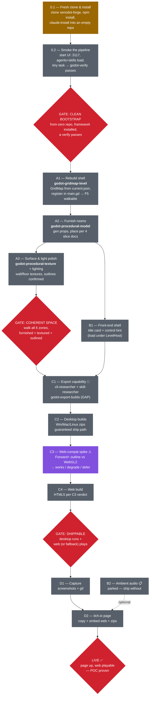

# Roadmap — itch.io Demo (Xenodot Forge proof-of-pipeline) ⏹ RETIRED (unbuilt idea)

> **Status: RETIRED — never built. Superseded by [`fps_poc.md`](./fps_poc.md).**
> This apartment-demo direction was an _idea_ that was scoped but never started (every phase
> below was 📋). The active POC is now a first-person shooter — see `fps_poc.md`. Kept here as a
> record of the explored direction; do not pick up phases from this doc.

---

> **The first end-to-end proof that the Xenodot Forge pipeline ships a real, public game.**
> Target: a furnished, explorable **3D-pixel-art apartment**, playable in-browser **and**
> downloadable on itch.io. **No win condition** — the apartment, and the way it was built
> (drawn grid → level-designer → game-designer → godot-dev → godot-verify), are the demo.
>
> **Built from a clean clone.** To prove the framework's _distribution_ — not just that it
> works in the repo where it was developed — the demo is built in a **fresh repo bootstrapped
> from zero** via the framework's install path (`npm run claude:install` from `xenodot-forge`).
> Shipping it then proves the full chain: clone the framework → install into an empty repo →
> drive the pipeline → ship a public game. This is **Track 0**, and it gates everything else.
>
> Builds on the completed foundation POC (`docs/roadmap/first_game.md`): player walk/jump,
> orthographic follow camera, SubViewport pixel-art rig, sun+shadow lighting, and depth/normal
> outline post-process are already ✅ and reused as-is.
>
> **This doc is hand-mirrored to `xenodot-forge/docs/roadmap/itch_demo.md`** — `npm run claude:sync`
> does NOT copy `docs/`, so edit both. Keep them identical.

## Roadmap graph

Legend: amber = next to build 🔨 · gray = planned 📋 · red = verification gate · purple ⚠ = technical risk/decision · 🔬 = capability gap routed through the researcher gate (human-approved).

## How to read this roadmap

Every phase is **executed through the pipeline** — game-designer (scope) → godot-dev (build) → godot-verify (gate) → human F5. The orchestrator never hand-codes game files. **New capabilities** (here: build export) enter via the self-improvement spine: flag the gap → researcher → human adopt/reject → registers back. **Only the verifier flips a phase's status (📋/🔨/✅)**, and only after running that phase's gate check — builders never self-mark done.

## Track 0 — Clean-clone bootstrap (prove distribution)

Everything downstream is built in **a repo created from zero** via the framework's install path,
so shipping the demo also proves a clean consumer can go _clone → working game_. This is the
honest POC: not "it works where we built it," but "anyone can install it and ship."

| Phase                         | Work                                                                                                                                                                                                                                                                                                                               | Reuses (already exists)                                                                                                    | Status  | Gate (observable)                                                                                            |
| ----------------------------- | ---------------------------------------------------------------------------------------------------------------------------------------------------------------------------------------------------------------------------------------------------------------------------------------------------------------------------------- | -------------------------------------------------------------------------------------------------------------------------- | ------- | ------------------------------------------------------------------------------------------------------------ |
| **0.1 Fresh clone & install** | Clone `xenodot-forge` into a clean location, `npm install`, then `npm run claude:install` (use `--force` for a clean reset) to populate an **empty** game repo's `.claude/` from the vendored `game-config/` mirror. Also confirms `claude:sync` parity — the mirror must be current or a clean install ships stale agents/skills. | `xenodot-forge/ui/server/claude-install.js`, `ui/server/claude-sync.js`, `.husky/pre-commit`, `xenodot-forge/game-config/` | 🔨 next | A from-zero repo whose `.claude/{agents,skills}` matches source; `git status` clean; install script exits 0. |
| **0.2 Smoke the pipeline**    | Start the web UI (port 3117), confirm the cloned `.claude/` agents + skills load (forms, permissions, task board render), then run one trivial end-to-end task (e.g. `/quick` tiny change → godot-dev → **godot-verify**) to prove the cloned framework actually drives Godot.                                                     | `xenodot-forge/ui/` (port 3117), skill `quick`, agent `godot-dev`, skill `godot-verify`                                    | 📋      | UI lists the real agents/skills; a one-step task builds + passes `godot-verify` in the fresh repo.           |
| **GATE: CLEAN BOOTSTRAP**     | —                                                                                                                                                                                                                                                                                                                                  | —                                                                                                                          | ⛔      | A from-zero repo with the framework installed and a verify passing — the apartment (Track A) is built here.  |

## Track A — Build the playable space (sequential)

| Phase                         | Work                                                                                                                                                                               | Reuses (already exists)                                                                                                                                                 | Status  | Gate (observable)                                                                                                                           |
| ----------------------------- | ---------------------------------------------------------------------------------------------------------------------------------------------------------------------------------- | ----------------------------------------------------------------------------------------------------------------------------------------------------------------------- | ------- | ------------------------------------------------------------------------------------------------------------------------------------------- |
| **A1 Rebuild shell**          | Rebuild the apartment shell via the GridMap pipeline; register it in `main.gd` `_levels` + set `initial_level`. (The old hand-built shell + builder were deleted in the refactor.) | `design/shared-apartment-shell.md`, skill `godot-gridmap-level`, `levels/drawn/current.json`, skill `godot-main-scene`                                                  | 🔨 next | **F5 fixes the black screen:** drop into the corridor, walk through door gaps into every zone; no wall clips; lit + pixelated.              |
| **A2 Furnish rooms**          | Generate placeholder props and place them per the four room slice docs.                                                                                                            | `tools/gen_models.gd` (skill `godot-procedural-model`); `design/shared-apartment-{bedroom-a,bedroom-b,kitchen-lounge,bathroom}.md`; skill `godot-mesh-import-pixel-art` | 📋      | Each room reads as that room (bed/wardrobe/desk, counter/stove/couch/tv, toilet/tub/vanity); props collide; F5 walk-through of all 6 zones. |
| **A3 Surface & light polish** | Procedural wall/floor surface textures, per-zone colour reads, lighting tune, confirm outlines hold up in the finished scene.                                                      | `tools/gen_textures.gd` (skill `godot-procedural-texture`); skills `godot-pixel-lighting`, `godot-screen-effects`                                                       | 📋      | Screenshot reads as a coherent pixel-art apartment with single-pixel outlines on depth/normal edges; not flat or top-down.                  |
| **GATE: COHERENT SPACE**      | —                                                                                                                                                                                  | —                                                                                                                                                                       | ⛔      | One F5 run: walk all six zones, furnished + textured + lit + outlined, `capture_screenshot.gd`-confirmed.                                   |

## Track B — Presentation (small; starts after A2)

| Phase                  | Work                                                                                                                                                                                          | Status    | Gate                                                                |
| ---------------------- | --------------------------------------------------------------------------------------------------------------------------------------------------------------------------------------------- | --------- | ------------------------------------------------------------------- |
| **B1 Front-end shell** | Minimal title card (title + "press to start" → loads the apartment under `Main/LevelHost`; never `change_scene_to_file`) and an on-screen control hint (WASD move · Space jump · Q/E rotate). | 📋        | Launch → title → keypress → walking in the apartment; hint visible. |
| **B2 Ambient audio**   | One ambient bed + footstep SFX. **Parked** — ship without it; pull in only if cheap.                                                                                                          | 📋 parked | —                                                                   |

## Track C — Ship (web + desktop)

| Phase                       | Work                                                                                                                                                                                                                                                                                                                                                                                                                                    | Status        | Gate                                                                                                  |
| --------------------------- | --------------------------------------------------------------------------------------------------------------------------------------------------------------------------------------------------------------------------------------------------------------------------------------------------------------------------------------------------------------------------------------------------------------------------------------- | ------------- | ----------------------------------------------------------------------------------------------------- |
| **C1 Export capability** 🔬 | No export skill or tool exists yet — this is the one genuine **capability gap**. Flag it → **cli-researcher** (export command spec → `library/tools/` + `tools/CAPABILITIES.md`) + **skill-researcher** (new `godot-export-builds` skill: export presets, headless `--export-release`, desktop first). Human-gated adopt/reject.                                                                                                        | 📋 (gap)      | A documented, repeatable export command + a registered skill.                                         |
| **C2 Desktop builds**       | Export Win/Mac/Linux release builds from the apartment scene. **This is the guaranteed ship path** (no renderer constraints).                                                                                                                                                                                                                                                                                                           | 📋            | Each build launches and is walkable (smoke-run per platform available).                               |
| **C3 Web-compat spike** ⚠   | Verify the signature look survives a **Web** export. The rig is **Forward+** + SubViewport downscale + depth/normal post-process outlines; the Web target runs **Compatibility/WebGL2** (no normal-roughness buffer) or **experimental WebGPU**. Decide early — outcome is one of: **(a)** web works acceptably, **(b)** web ships with a **degraded look** (outlines off / simplified), **(c)** **web deferred**, desktop-only for v1. | 📋 (decision) | A written verdict + a loading web build (full or agreed-degraded), or a logged decision to defer web. |
| **C4 Web build**            | HTML5 export per C3's verdict.                                                                                                                                                                                                                                                                                                                                                                                                          | 📋            | Plays in-browser (itch.io iframe). Skipped if C3 = defer.                                             |
| **GATE: SHIPPABLE**         | —                                                                                                                                                                                                                                                                                                                                                                                                                                       | ⛔            | Desktop builds run; web build (or its agreed fallback) plays in a browser.                            |

## Track D — itch.io page

| Phase                | Work                                                                                                                                  | Status | Gate                                                          |
| -------------------- | ------------------------------------------------------------------------------------------------------------------------------------- | ------ | ------------------------------------------------------------- |
| **D1 Capture**       | Screenshots + a short gif of the walk-through.                                                                                        | 📋     | `tools/capture_screenshot.gd` → 3–5 stills + 1 gif.           |
| **D2 Page & upload** | Page copy (the "built end-to-end by an agent pipeline" story), embed the web build, attach the desktop zips, set title/tags/metadata. | 📋     | **Page live; web build playable in-browser.** ← _POC proven._ |

## Out of scope (do not let agents drift into these)

Win/loss/objective, the dice/fate mechanic, NPCs/dialogue, inventory UI, save/load, levels
beyond the one apartment, animation retargeting (a static capsule or a single looping idle is
fine), particles/VFX beyond the existing outline pass, networked/multiplayer, monetization.

## Open risk — the web build

The web build is the only genuinely uncertain item. The depth/normal Forward+ outline pass is
the heart of the look and is **not guaranteed** under the Web (Compatibility/WebGL2) renderer;
WebGPU export is experimental in Godot 4.6. This roadmap therefore makes **desktop the
guaranteed ship** and gates web behind the **C3 spike** with three explicit fallbacks — so
"both web + desktop" never blocks shipping the proof. Treat C3 as a decision point, not an
assumption.

## Open question — what carries into the from-zero repo

`claude:install` ships only `.claude/{agents,skills}` — **not** design docs or levels. So the
fresh Track-0 repo starts without the apartment inputs (`design/shared-apartment-*.md`,
`levels/drawn/current.json`). Two ways to feed Track A, to confirm before A1:

- **(stronger proof)** Re-draw the apartment in the **Draw-Level tool** and re-run
  level-designer → game-designer in the fresh repo — exercises the whole pipeline from zero,
  not a replay of saved artifacts.
- **(faster)** Copy the existing design slices + `current.json` into the fresh repo and build
  straight from them.

Default assumed here: **stronger proof** (re-draw), since the point of Track 0 is to prove the
pipeline, not the artifacts. Flag if you'd rather take the faster path.
