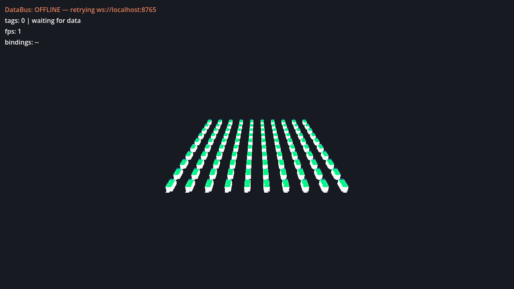

# City-scale demo — repeated BIM, optimized, measured

This walkthrough takes an already-imported Duplex model to a **generated 10×10 "city block"** of
repeated real BIM — 28,600 mesh instances — then runs it through the scene optimizer and lets you
**measure the difference yourself**. It is the scale/rendering sibling of the
[house](digital-twin.md) and [plant](plant-twin.md) tutorials: same toolkit, a deliberately
different job. The house teaches the pipeline and the plant shows **data binding**; this one is
about **scale and instancing**, and nothing else.



> **What this demo is — read this first.** This is a **rendering / scale stress scene**, not a
> live multi-building digital twin. `gen_city.gd` deep-copies **one** loaded `duplex.glb` into a
> grid; it does **not** mint new per-copy identities. Every GlobalId-bearing node name is
> **duplicated verbatim** across all 100 copies. The join gate below reports 100% — but not
> because every building has a unique, resolvable identity: it reports 100% because every
> duplicated candidate matches the same sidecar key. Concretely, **if you painted live data onto
> one of these ids, all 100 copies would paint identically.** A real multi-building site needs
> per-building-unique ids upstream (out of scope here). That is the honest read straight from the
> [optimizer benchmark finding](../../plugin/library/findings/twin-optimizer-benchmark-2026-07-08.md);
> this tutorial inherits it rather than softening it.

> **Every number below was actually run** on one machine (macOS, M3 Pro / Metal, Godot 4.6.3). The
> **deterministic** numbers — mesh/node census (28,600 / 28,703), the optimizer's instancing
> counts, the 100% join — reproduce exactly because the generator has no RNG and no wall-clock. The
> **fps / cpu / draw-call** numbers are this machine's, this session's: my window capped frame
> presentation at **60 Hz** (the benchmark finding's ran on a 120 Hz ProMotion panel), so read the
> optimizer win off `cpu_ms` and `draw_calls`, not fps — see [Measure it](#measure-it--before-vs-after).

---

## Prerequisites

Same four as the house and plant tutorials — if you did either, you have all of them:

- **Claude Code** + the bundled `xenodot` plugin.
- **Godot 4.x** — 4.6.3 here. Export the path once:
  ```bash
  export GODOT=/Applications/Godot.app/Contents/MacOS/Godot
  ```
- **Node 18+** — 22 here (for `npm run new`).
- **`uv` + Python 3.12** — only to produce the Duplex GLB, exactly as the house tutorial's
  [Step 4](digital-twin.md#step-4--the-ifc-import-real-geometry-real-join-key) does.

Plus one input this tutorial assumes you already have:

- **A Duplex GLB + property sidecar** under `models/`. If you followed the house tutorial you built
  one; if not, the three lines in [Generate the city](#generate-the-city) reproduce it. Record the
  filename you end up with — this session's is `models/duplex.glb` + `models/duplex_props.json`.

---

## Scaffold a throwaway viewer

The city scene, its optimized variants, and the bench reports are all **regenerable scratch** —
nothing here is meant to be committed. Do it in a disposable sibling project:

```bash
# From inside the framework clone:
npm run new -- ../city-scale --viewer      # prints "doctor: OK"
cd ../city-scale

# Get a Duplex GLB in place (the same pinned-venv convert the house tutorial teaches):
mkdir -p models
cp ../xenodot-twin/plugin/examples/Duplex_A_20110907.ifc models/
tools/twin_venv.sh                                                   # provision .venv-ifc once
tools/twin_venv.sh --run tools/ifc_convert.py models/Duplex_A_20110907.ifc \
  --glb models/duplex.glb --sidecar models/duplex_props.json
```

```
GLB written: models/duplex.glb — 286 shapes in 0.9s
sidecar: models/duplex_props.json — 295 elements in 0.1s
```

That is the same **286-mesh** Duplex the house tutorial uses (295 sidecar keys — a few unnamed
helper nodes over the 286 meshes). `models/` is gitignored; these are runtime-loaded build
artifacts, never editor-imported.

---

## Generate the city

`gen_city.gd` is a **demo-asset generator** — it lives in the framework's `examples/`, like
`gen_plant_ifc.py`, and is **never materialized into a project's `tools/`**. You run it as a
`--script` against your viewer project. Its header offers two ways in ("copy this file into it or
pass its path to `--script`"); **on Godot 4.6.3 the external path works directly**, so you never
copy the file into your project:

```bash
$GODOT --headless --path . \
  --script ../xenodot-twin/plugin/examples/gen_city.gd -- \
  --src=res://models/duplex.glb --out=res://models/city_before.scn --grid=10 --pitch=30.0
```

```
GENCITY: OK {"copies":100,"grid":"10x10","meshes":28600,"nodes":28703,"output":"res://models/city_before.scn","pitch_m":30.0}
```

~1.0 s wall-clock (this machine, including engine startup). What you just built: a **10×10 lattice
of 100 duplex copies** on the XZ plane at **30 m pitch** (30 m clears each duplex's ~10 m footprint
with a street-width gap between rows), plus one shadowless `DirectionalLight3D` and a flat-ambient
`WorldEnvironment` so a bench/screenshot camera sees a lit scene. 100 copies × the Duplex's 286
meshes = **28,600 `MeshInstance3D`s** (28,703 nodes). Output is a binary `.scn` on purpose:
runtime-loaded GLB meshes have no `resource_path`, so a `.tscn` would serialise them inline into a
huge text file.

> **Shadows are off by design.** `gen_city.gd` ships a single shadowless key light + flat ambient
> so a shadow pass never re-ranks the draw cost and confounds the instancing-only measurement. If
> the flat lighting looks unusual, that is why — it is a benchmark scene, not a beauty shot.

---

## Optimize it — and why the old default regressed

The optimizer groups repeated `MeshInstance3D`s by shared mesh + material into region-chunked
`MultiMeshInstance3D` fields. The knob that matters at this scale is the **chunk grid**. Run the
defaults first:

```bash
$GODOT --headless --path . --script tools/optimize_scene.gd -- \
  --in=res://models/city_before.scn --out=res://models/city_after.scn \
  --report=reports/city_after.json
```

> **First run on a fresh project fails with `Identifier "TwinChunks" not declared`?** The optimizer
> resolves `class_name` helpers (`tools/lib/`) that Godot only registers during a resource-import
> scan — a freshly scaffolded project that was never opened has run none. Seed the global class
> cache once, then re-run:
>
> ```bash
> $GODOT --headless --path . --import      # populates .godot/global_script_class_cache.cfg
> ```
>
> `twin_build.sh` does this for you automatically; running the optimizer by hand is what exposes
> it. It is cheap and idempotent — a warm project skips it.

```
OPTIMIZE: OK {"chunks":"auto",...,"groups_instanced":224,"groups_total":224,"instances_total":28600,
              "multimeshes":1140,"nodes_before":28703,"nodes_after":1244,
              "est_draw_items_before":34800,"est_draw_items_after":1376,"target_per_chunk":32,
              "occluders_added":0,"vis_ranges_set":0,"globalid_map_size":28600}
```

The default is **`--chunks=auto`**: it derives a per-group grid so every cell holds ~32 instances.
On these ~100-instance groups it picks a 2×2 grid and emits **1,140 multimeshes** — the sane band —
collapsing 28,703 nodes to **1,244** and 34,800 estimated draw items to **1,376**.

That auto default is **new**, and it matters. The benchmark finding this scene comes from was
written when the default was a **fixed** `--chunks=8`, which _regressed_ the same scene. You can
still reproduce that regression by forcing it — and you should see it once, so you trust the auto
default:

```bash
$GODOT --headless --path . --script tools/optimize_scene.gd -- \
  --in=res://models/city_before.scn --out=res://models/city_after_c8.scn \
  --chunks=8 --report=reports/city_after_c8.json
$GODOT --headless --path . --script tools/optimize_scene.gd -- \
  --in=res://models/city_before.scn --out=res://models/city_after_c2.scn \
  --chunks=2 --report=reports/city_after_c2.json
```

| config              | multimeshes | nodes_after | est_draw_items_after |
| ------------------- | ----------- | ----------- | -------------------- |
| `--chunks=8` forced | **14,336**  | 14,440      | 15,424               |
| `auto` (default)    | 1,140       | 1,244       | 1,376                |
| `--chunks=2`        | 896         | 1,000       | 964                  |

A fixed 8×8 grid over 100-instance groups makes `64 cells × 224 groups = 14,336` multimeshes of
~2 instances each — pure per-object overhead. `--chunks=2` (~32/chunk) is the finding's hand-picked
optimum, and **`auto` lands right next to it without you tuning anything**. All three preserve the
full instancing (224/224 groups, 28,600 instances) — the difference is entirely how finely the
field is diced. (`occluders_added: 0` / `vis_ranges_set: 0`: those passes only touch _un-instanced_
meshes, and the instancing pass consumed every mesh here — more on that under
[Go deeper](#go-deeper).)

---

## The join gate — and the duplicate-id caveat

Run the GlobalId join gate on the optimized scene against the Duplex's own sidecar, writing a
machine-readable verdict alongside the log line:

```bash
$GODOT --headless --path . --script tools/check_twin_join.gd -- \
  --scene=res://models/city_after_c2.scn --sidecar=models/duplex_props.json \
  --json=reports/city_join_verdict.json
```

```
SIDECAR_KEYS=295
JOIN-SOURCES: mesh_nodes=0 multimesh_ids=28600
JOIN: 28600/28600 (100.0%)
JOIN-GATE: OK (min 95.0%)
```

```json
{
  "join_gate": "OK",
  "join_matched": 28600,
  "join_total": 28600,
  "join_pct": 100.0,
  "mesh_nodes": 0,
  "multimesh_ids": 28600,
  "sidecar_keys": 295,
  "join_min_pct": 95.0
}
```

**Read this number correctly.** The optimizer preserved the join by stamping each chunk with a
`twin_globalids` meta — a `PackedStringArray` of the original node names, one per instance — so all
28,600 instances count as join candidates (`multimesh_ids=28600`, `mesh_nodes=0`). Every one matches
a sidecar key, so 100%. But there are only **295 distinct keys**: each of the Duplex's ids appears
**100 times**, once per copy. The gate proves _"every rendered instance resolves to a property
record,"_ **not** _"every building has a unique identity."_ This is the
[honest caveat from the top of the tutorial](#city-scale-demo--repeated-bim-optimized-measured),
now with the mechanism attached: `set_instance_color` on one of these ids would paint all 100 copies
the same colour. It is a scale demo, not a per-building twin.

---

## Measure it — before vs. after

`bench_scene.gd` measures fps the only honest way on macOS (`Engine.get_frames_drawn()` delta), with
vsync off and the window forced foreground. It needs a **real display** — headless SKIPs, never
fabricates. Two vantages: a **street** camera down a row at eye height, and an **aerial** oblique
with the whole block in frustum (both derived for this 270 m × 270 m block; the street string is the
finding's, still valid at the same grid/pitch):

```bash
ST="139.5,1.7,135:139.5,1.7,0"                     # street: eye height, looking down a row
AER="135,300,420:135,0,135"                        # aerial: oblique, whole block in frame

$GODOT --path . -s tools/bench_scene.gd -- res://models/city_before.scn   --vantage "$ST"  --warmup 2 --measure 10
$GODOT --path . -s tools/bench_scene.gd -- res://models/city_before.scn   --vantage "$AER" --warmup 2 --measure 10
$GODOT --path . -s tools/bench_scene.gd -- res://models/city_after_c2.scn --vantage "$ST"  --warmup 2 --measure 10
$GODOT --path . -s tools/bench_scene.gd -- res://models/city_after_c2.scn --vantage "$AER" --warmup 2 --measure 10
```

This session's `BENCH:` rows (M3 Pro / Metal, 60 Hz window this run):

| scene      | vantage | fps        | frame_ms | cpu_ms   | draw_calls | objects | primitives |
| ---------- | ------- | ---------- | -------- | -------- | ---------- | ------- | ---------- |
| before     | street  | 60.8 (cap) | 16.44    | 2.88     | 1,828      | 11,829  | 0.81M      |
| before     | aerial  | 60.1 (cap) | 16.65    | 5.17     | 5,559      | 40,500  | 2.77M      |
| after (c2) | street  | 59.9 (cap) | 16.68    | **1.07** | **542**    | 542     | 1.39M      |
| after (c2) | aerial  | 59.9 (cap) | 16.68    | **1.20** | **1,084**  | 1,084   | 2.77M      |

**fps is pinned at this session's 60 Hz presentation cap in every row** — before and after. macOS
caps frame presentation at the display refresh even with vsync disabled, so at the cap fps tells you
nothing about headroom; a flat-at-cap result is honest, not a null result. The win is in the
**cap-immune** columns — `cpu_ms` (render-thread submit) and `draw_calls`:

- **Street:** cpu `2.88 → 1.07 ms` (**−63%**), draw calls `1,828 → 542` (**−70%**), objects
  `11,829 → 542`.
- **Aerial:** cpu `5.17 → 1.20 ms` (**−77%**), draw calls `5,559 → 1,084` (**−80%**), objects
  `40,500 → 1,084`.

The deterministic columns match the benchmark finding **exactly** (aerial `objects 40,500`,
`draw_calls 1,084` after; c2 street `542`) — the geometry is identical, only my fps ceiling differs.
The finding's own machine had a **120 Hz** window and a **20×20** supplement (114,400 meshes) that
finally left the cap, where aerial went **27.3 → 119.4 fps (≥4.4×)**. That headroom is real but not
reproduced here — cite it as further evidence, not this session's number.

And the regression is measurable too, even at the cap — force `--chunks=8` and bench the aerial:

```bash
$GODOT --path . -s tools/bench_scene.gd -- res://models/city_after_c8.scn --vantage "$AER" --warmup 2 --measure 10
```

`c8` aerial reads `cpu 7.21 ms, draw_calls 17,344` — **worse than not optimizing at all** (before
was 5.17 ms / 5,559 calls). The auto default at the same vantage reads `cpu 1.15 ms,
draw_calls 1,594` — right on top of the hand-tuned c2. That is the whole point of the auto grid:
the default is now the right answer.

---

## See it

Boot the optimized scene the same way the other tutorials boot theirs — the viewer loads an
arbitrary scene from a `--model=` user arg (after the `--` separator):

```bash
$GODOT --path . -- --model=models/city_after_c2.scn
```

The HUD reads **OFFLINE** — correct: there is no sim and no binding map here, this is pure geometry.
You should see a dense grid of duplexes under flat, shadowless lighting.

> **Wrinkle — the auto-frame zooms in on the _optimized_ scene.** The viewer's "frame the model"
> camera walks `MeshInstance3D` bounds only, and the optimized scene's geometry lives in
> `MultiMeshInstance3D` chunks — so it finds nothing to frame and lands zoomed on a single roof. To
> get the overview shot (the image at the top of this page), boot **`city_before.scn`** instead: its
> 28,600 individual `MeshInstance3D`s give the framing heuristic the full-block AABB. The two render
> identically — optimization is visually lossless — so the before scene is a faithful preview of the
> after. Or use the bench vantages above to fly a camera yourself.

---

## Optional — a hero image, honestly a still

The other tutorials record a moving hero clip because their scenes have **motion** — telemetry
painting, a scrubbable recording. This scene has none: it is static geometry with no data source, so
a `--write-movie` capture would be a frozen frame. The honest illustration is a **still**, captured
with the viewer's built-in screenshot flag (windowed — headless renders black):

```bash
$GODOT --path . -- --model=models/city_before.scn \
  --screenshot=city-hero.png       # 1280×720 PNG of the framed overview
```

The image at the top of this tutorial was made exactly this way. To **publish** a web demo of a twin
(the plant/house kits, which do move), use
[`tools/twin_publish_web.sh`](../../plugin/tools/CAPABILITIES.md) — a separate,
human-gated step, out of scope here.

---

## Go deeper — the next knobs (pointers, not re-derivation)

This city is **fully instanced**: every one of its 286 mesh types repeats 100×, so the instancing
pass consumes everything and the remaining optimizer knobs are **no-ops on this scene** (the reports
above show `occluders_added: 0`, `vis_ranges_set: 0`). They matter on _heterogeneous / mostly-unique_
geometry — a single real building's un-instanced leftovers, or plant-fitting clutter. Where to read
when you have such a scene:

- **`--vis-ranges`** — distance culls small/medium un-instanced meshes.
  [`twin-vis-range-recipe-2026-07-09.md`](../../plugin/library/findings/twin-vis-range-recipe-2026-07-09.md).
- **`--vis-fade-margin` / `--vis-fade-mode`** — an alpha ramp so the aggressive vis-range tier fades
  instead of popping (Forward+ only).
  [`twin-vis-fade-2026-07-10.md`](../../plugin/library/findings/twin-vis-fade-2026-07-10.md).
- **`--occluders`** — box occluders on large un-instanced meshes (a scoped street-level win, net
  cost on single buildings).
  [`twin-occluder-recipe-2026-07-10.md`](../../plugin/library/findings/twin-occluder-recipe-2026-07-10.md).
- **`tools/bench_sweep.sh`** — run a whole optimize×vantage matrix declaratively instead of
  hand-running each pair; its worked example
  ([`bench_sweep.vis-fade.example.json`](../../plugin/examples/bench_sweep.vis-fade.example.json))
  regenerates this exact city as its `scene_in`.

The [`twin-optimize` skill](../../plugin/skills/twin-optimize/SKILL.md) is the operator's
reference for all of these, including the `--chunks` guidance this tutorial exercised.

---

## Wrinkles I actually hit

- **The external `--script` path works — no copy needed.** `gen_city.gd`'s header offers copying the
  file into the project _or_ passing its path to `--script`. On Godot 4.6.3 the external path
  (`--script ../xenodot-twin/plugin/examples/gen_city.gd`) ran cleanly, so the demo-asset
  generator never has to land in your project tree.
- **The optimizer's first run needs a class-cache seed.** On a never-opened project it parse-fails
  on `TwinChunks`; a one-off `$GODOT --headless --path . --import` fixes it (covered inline above).
  `twin_build.sh` hides this; the by-hand path exposes it.
- **The default optimizer chunking changed since the benchmark finding.** The finding's `--chunks=8`
  default is now `--chunks=auto`, and auto matches the hand-tuned `--chunks=2` — the regression only
  appears if you force `--chunks=8`. If you follow an older doc that says "the default regresses,"
  that is no longer true of the default.
- **fps was flat at a 60 Hz cap this session** (the finding's machine had 120 Hz). Both before and
  after pin at the cap at 10×10, so the win reads off `cpu_ms` and `draw_calls`. This is expected,
  not a failure — see the benchmark finding's "macOS caps frame PRESENTATION" note.
- **The viewer misframes the optimized scene** (MultiMesh chunks escape the mesh-AABB frame walk) —
  boot `city_before.scn` for the overview, covered under [See it](#see-it).

---

## Troubleshooting

- **`GENCITY: FAIL — --src= and --out= are required`.** Both are mandatory. `--src=` points at your
  GLB (`res://models/duplex.glb` or an absolute path), `--out=` at the `.scn` to write.
- **`Identifier "TwinChunks" not declared` on the first optimize.** The global class cache is not
  seeded — run `$GODOT --headless --path . --import` once, then re-run the optimizer.
- **`BENCH: SKIP — headless renderer`.** The bench needs a real display; drop `--headless` and run
  from a desktop session. A SKIP is not a pass.
- **A `--model=` flag is silently ignored.** You forgot the `--` separator. Godot eats unknown engine
  flags without complaint; anything for the viewer must come **after** a bare `--`.
- **Booting the optimized scene zooms onto one roof.** Expected — boot `city_before.scn` for the
  auto-framed overview, or bench with an explicit `--vantage`.
- **`pip install ifcopenshell` → no matching distribution.** Your Python is too new (3.14 has no
  wheel). Use `tools/twin_venv.sh` (pinned 3.12), as in the house tutorial.

---

## Committing — nothing to commit

Unlike the house and plant tutorials, this one produces **no project worth keeping**. The
`city_*.scn`, the `reports/*.json`, and any screenshot are **regenerable scratch** — the generator is
deterministic in structure, so you rebuild them from `duplex.glb` whenever you need them (`models/`
and `reports/` are gitignored anyway). Delete the `../city-scale` scaffold when you are done; the
recipe above rebuilds it from nothing in under two seconds of tool wall-clock.
