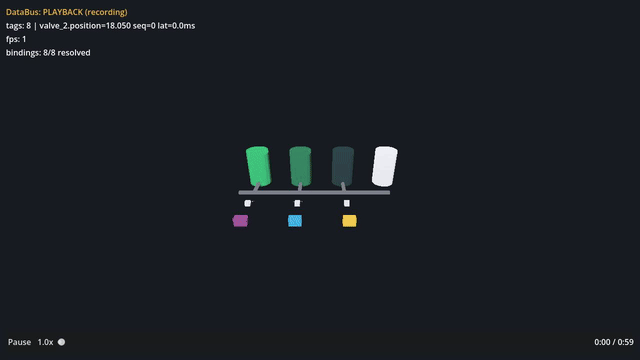

# Synthetic-plant twin, from scratch

This walkthrough takes an empty folder to a **live, painted digital twin of a synthetic
tank-farm / pump-skid** — tank levels, pump temperature and flow, motor RPM and valve position,
each painted onto real IFC geometry from streaming telemetry, with deterministic playback and a
green end-to-end gate. It is the sibling of the [house tutorial](digital-twin.md): same pipeline,
different asset.



> **What this demo is — read this first.** The plant is a **flavor + data-binding showcase**, not
> a performance / optimizer showcase. Its geometry is **synthetic** — generated by
> `gen_plant_ifc.py`, with no real-world provenance (the label _"synthetic demonstration model"_
> is written into the IFC header on purpose). And the scene optimizer is a **structural no-op** on
> it: every element is unique geometry, so there is nothing to instance at any scale. That is a
> settled, measured finding —
> [`twin-plant-asset-2026-07-10.md`](../../plugin-twin/library/findings/twin-plant-asset-2026-07-10.md)
> — and this tutorial inherits its honest framing rather than re-testing it. If you want the
> _scale / instancing_ story, that is the city benchmark, not this. What the plant _does_ show
> beautifully is **data binding**: eight literal plant tags (pump/tank/valve/motor) painting
> live onto labelled equipment.

**House vs. plant — which demo when** (straight from
[`plugin-twin/examples/README.md`](../../plugin-twin/examples/README.md)):

- **House** (Duplex) — a **real BIM model, small and fast**: the _teaching_ asset, the thing you
  learn the pipeline on. Start there ([`digital-twin.md`](digital-twin.md)).
- **Plant** — **synthetic, industrial-flavored**: the _pitch_ asset, for showing "looks like my
  plant." Its tags speak the sim's built-in plant vocabulary out of the box.

Both kits use the **identical** build path, so this tutorial is deliberately shorter than the
house one — it assumes you have read the house tutorial and focuses on what is plant-specific.

> **Every number below was actually run** on one machine (macOS, M3 Pro / Metal, Godot 4.6.3,
> Node 22, Python 3.12, `ifcopenshell` 0.8.5). Frame counts, the sha256, the JOIN/BIND counts and
> the byte sizes are copy-pasted from that session; on another machine the geometry-independent
> numbers (JOIN 18/18, the recording sha256, 0 instancing) reproduce exactly because the asset is
> deterministic, while any wall-clock timings are this machine's.

---

## Prerequisites

Same four as the house tutorial — if you already did that one, you have all of them:

- **Claude Code** — the framework is driven by Claude Code + the bundled `xenodot` plugin. This
  tutorial does the whole pipeline by hand from a terminal.
- **Godot 4.x** — 4.6.3 here. Export the path once:
  ```bash
  export GODOT=/Applications/Godot.app/Contents/MacOS/Godot
  ```
- **Node 18+** — 22 here.
- **`uv` + Python 3.12** — only for the IFC import step. `ifcopenshell` ships **no wheel for
  Python 3.14**, so the converter runs in a pinned 3.12 venv. `brew install uv python@3.12`
  covers it.

Assuming you already cloned the framework in the house tutorial (into
`your-workspace/xenodot-twin`), pick up from there. If not, clone it and prove it's green first —
[house tutorial, Step 1](digital-twin.md#step-1--clone-the-framework-and-prove-its-green).

---

## The one command — the fast path

From inside the framework clone, scaffold a **viewer** project into a sibling folder, drop the
**plant** kit in, create the pinned venv once, then let `tools/twin_build.sh` run
import → optimize → verify as one gated command:

```bash
# 1. Scaffold a viewer project (creates ../plant with tools/, library, etc.):
npm run new -- ../plant --viewer          # prints "doctor: OK"
cd ../plant

# 2. Copy the PLANT kit in (three files — the IFC goes under models/ so build artifacts co-locate):
mkdir -p models
cp ../xenodot-twin/plugin-twin/examples/plant.ifc models/
cp ../xenodot-twin/plugin-twin/examples/binding_map.plant.example.json binding_map.json
cp ../xenodot-twin/plugin-twin/examples/viewer.cfg.plant.example viewer.cfg

# 3. Provision the pinned 3.12 ifcopenshell venv ONCE (idempotent; twin_build looks for exactly
#    .venv-ifc and never auto-creates it — a missing venv FAILs loud):
tools/twin_venv.sh

# 4. One gated command → optimized, join-verified, binding-smoked twin + the exact boot command:
tools/twin_build.sh models/plant.ifc --map binding_map.json
```

> **`twin_venv.sh` is the current one-liner for the venv.** It wraps the raw
> `uv venv --python 3.12 .venv-ifc && uv pip install --python .venv-ifc/bin/python ifcopenshell==0.8.5`
> the house tutorial spells out: an existing valid `.venv-ifc` is reused, a
> missing one is provisioned, a **version mismatch FAILs loud** (never a silent rebuild). Same
> drift-visible discipline as `twin_build.sh`. First run installs 8 packages in a second or two:
>
> ```
> twin-venv: OK — provisioned .venv-ifc (ifcopenshell 0.8.5, python 3.12)
> ```

Five loud stages — preflight → import → optimize → verify → summary — exit 0 only if every
non-SKIP gate passed. The real output, plant-specific bits highlighted:

```
== twin-build [2/5] import (ifc_convert.py) ==
opened models/plant.ifc schema=IFC4
GLB written: models/plant.glb — 18 shapes in 0.0s
sidecar: models/plant_props.json — 18 elements in 0.0s
== twin-build [3/5] optimize (optimize_scene.gd) ==
OPTIMIZE: OK {... "groups_total":18,"groups_instanced":0,"multimeshes":0,
               "est_draw_items_before":18,"est_draw_items_after":18 ...}
== twin-build [4/5] verify (verify_twin.sh) ==
JOIN: 18/18 (100.0%)
JOIN-GATE: OK (min 95.0%)
BIND-SMOKE: OK — 8 node target(s), 0 mmi target(s), 120 frames, 0 drops
verify-twin: SKIP frame-budget — windowed bench not run (a SKIP is not a pass)
== twin-build [5/5] summary ==
  boot the optimized twin (live against the sim):
    $GODOT --path . -- --model=models/plant_opt.tscn
twin-build: OK
```

Three things to read in that output — they _are_ the plant's honest story:

- **`groups_instanced: 0`, `multimeshes: 0`, `est_draw_items 18 → 18`.** The optimizer changed
  nothing, exactly as the finding says: the generator authors a fresh geometry per element, so
  there is no shared mesh resource to instance. This is expected and correct here — the plant is
  not an optimizer demo.
- **`JOIN: 18/18 (100.0%)`.** Every mesh node matched a sidecar key by GlobalId — the join spine
  is intact (18 elements: 4 tanks + 3 pumps + 3 valves + 8 pipe segments).
- **`BIND-SMOKE: OK — 8 node target(s)`.** All eight plant tags resolved to real elements and the
  seeded sim drove them. (The smoke reports `driven=6 … moved=6` for eight bindings because two —
  the valves — are **labels**, not paints; that is correct, not a miss.)

Boot the printed `--model=` command to see it. The copied `viewer.cfg` points `model=` at the
teaching path's `res://models/plant.glb` (which the fast path never builds — it stops at the
optimized `.tscn`), so a bare `$GODOT --path .` comes up empty. Use the printed command, or rerun
`twin_build.sh … --wire` to point `viewer.cfg` at the optimized scene (keeps a `viewer.cfg.bak`).

The rest of this tutorial unrolls that one command — the same pipeline, one gate per section.

---

## The by-hand path (the teaching step)

The one command compresses the pipeline; running the import by hand is how you learn the join.
Convert the IFC → GLB (node names = GlobalIds) + a property sidecar keyed by the same ids —
`twin_venv.sh --run` executes any script with the pinned venv's Python, so you never activate it:

```bash
tools/twin_venv.sh --run tools/ifc_convert.py models/plant.ifc \
  --glb models/plant.glb --sidecar models/plant_props.json
```

```
opened models/plant.ifc schema=IFC4
GLB written: models/plant.glb — 18 shapes in 0.2s
sidecar: models/plant_props.json — 18 elements in 0.0s
```

The GLB + sidecar under `models/` are **gitignored** — runtime-loaded data (`GLTFDocument` at
runtime, no editor import), rebuilt from the IFC whenever you need them. The 22-char IFC GlobalId
is the join key everywhere: the GLB's node names carry it, the sidecar is keyed by it, and the
binding map's `globalid` field points at it.

**Optional — machine-readable verdicts.** The join and bind gates also write a structured
verdict (not just a log line), which is how a CI step or an orchestrator reads pass/fail without
scraping text. Both merge into one file:

```bash
$GODOT --headless --path . --script tools/check_twin_join.gd -- \
  --scene=models/plant.glb --sidecar=models/plant_props.json --json=reports/plant_verdict.json
# → JOIN: 18/18 (100.0%) ; JOIN-GATE: OK — and reports/plant_verdict.json gets join_gate:"OK"
```

The bind smoke merges its own verdict into the **same** file — but note it needs a data source
running (see the Troubleshooting note about `--url`), unlike `verify_twin.sh` which spawns and
reaps its own sim. With a sim up the merged struct reads `{"join_gate":"OK","bind_smoke":"OK",
"resolved":8,"total":8}` — the whole gate in one JSON object.

---

## The bindings — eight plant tags

`binding_map.json` maps process-telemetry tags to real plant elements by GlobalId. The kit ships
one authored against the **bundled** `plant.ifc` (generated at `--seed 42`, 4 tanks / 3 pumps),
deterministic across converts of that file, so it works as-is. Its `_about` field documents every
row; the eight tags:

| tag                | element                        | response  | ramp                                         |
| ------------------ | ------------------------------ | --------- | -------------------------------------------- |
| `pump_1.temp`      | IfcPump P-101 Feed Pump        | paint     | blue `#1e63ff` → red `#ff2f2f` (20–90 °C)    |
| `pump_2.flow`      | IfcPump P-102 Transfer Pump    | paint     | dark `#14142a` → cyan `#39d0ff` (0–100 m³/h) |
| `motor_1.rpm`      | IfcPump P-103 Circulation Pump | paint     | dark → amber `#ffcf3f` (0–3000 rpm)          |
| `tank_1.level`     | IfcTank TK-101 Buffer          | paint     | dark → green `#37d67a` (0–100 %)             |
| `tank_2.level`     | IfcTank TK-102 Feed            | paint     | dark → green (0–100 %)                       |
| `tank_3.level`     | IfcTank TK-103 Product         | paint     | dark → green (0–100 %)                       |
| `valve_1.position` | IfcValve V-101 Shutoff         | **label** | green closed `#37d67a` → red open `#ff5252`  |
| `valve_2.position` | IfcValve V-102 Shutoff         | **label** | green closed → red open                      |

Six paints + two labels = the eight tags the bind smoke resolved. The sim derives its tag list and
each tag's `[min,max]` **from this file**, so data and geometry can never drift. `viewer.cfg` ties
it together: `model=`, `url="ws://localhost:8765"` (where the sim listens), `binding_map=` and a
`frame_budget_ms=16.7` (the 60 fps floor). `recording=` is left unset, so a plain boot is **live**.

---

## See it — boot the painted plant

**Live** — start the sim, launch the viewer against the optimized scene:

```bash
node tools/sim/server.js --map binding_map.json &      # terminal 1
$GODOT --path . -- --model=models/plant_opt.tscn        # terminal 2
```

The plant loads and the HUD reads **LIVE** (green), `bindings: 8/8 resolved`. The three pumps
paint (P-101 blue→red on temperature, P-102 dark→cyan on flow, P-103 dark→amber on RPM), the
three tanks fill dark→green on level, and two floating valve labels show position (green closed →
red open). Stop the sim and the HUD goes **OFFLINE** (red); restart it and the viewer reconnects.

> **Visualization, not simulation.** The viewer _paints_ values it is fed — it does not model plant
> physics. The seeded sim is a deterministic **test fixture** standing in for a real source; point
> the same `viewer.cfg [twin] url=` at your MQTT bridge or relay and real telemetry paints the same
> elements (see the house tutorial's MQTT section — the plant uses the identical seam).

---

## Record a deterministic fixture

For scrubbable playback, synthesize a fixture from the same generator — no network, byte-reproducible
per (seed, seconds, hz):

```bash
mkdir -p recordings
node tools/sim/record.js --out recordings/plant-shift.ndjson --seconds 60 --seed 42 --hz 10 --map binding_map.json
```

```
record: wrote recordings/plant-shift.ndjson — frames=4800 duration_ms=59900 tags=8 sha256=163e40f6c4333448061c80137c197139c22e55aef84eef001dd651c6b3b6e7b1
```

That is **4800 frames** (600 ticks × 8 tags), 59.9 s, 348,167 bytes. It is deterministic: recording
it a second time produces a **byte-identical** file with the same sha256 — that is the whole point
of the playback gate. `recordings/` is **committed** (unlike `models/`) — the fixture is repo
content.

Play it back (no sim needed) — pass the recording on the command line:

```bash
$GODOT --path . -- --model=models/plant_opt.tscn --recording=recordings/plant-shift.ndjson
```

The HUD turns amber **PLAYBACK**, a timeline bar appears at the bottom, and the fixture plays through
the _same_ binding runtime live data uses. `Tab` toggles the camera between ORBIT and FLY; `Space`
plays/pauses; the timeline slider scrubs and the speed button cycles 0.25× … 4×.

---

## Optional — capture a local hero clip

If `ffmpeg` is on PATH (`which ffmpeg`) **and** you have a real display, you can record the painted
plant to a small local clip — the same `--write-movie` + `ffmpeg` recipe the publish pipeline uses,
run by hand against the viewer. This is **not** the publish pipeline: it writes local files only.

```bash
# 1. Windowed capture straight to an AVI (Movie Maker; headless renders black, so no --headless).
#    quit-after N frames; the wired recording autoplays so the clip shows moving data:
$GODOT --path . --write-movie plant-hero.avi --fixed-fps 60 -- \
  --model=models/plant_opt.tscn --recording=recordings/plant-shift.ndjson --quit-after=360

# 2. Encode to a web-friendly mp4, a small gif, and a poster frame (same flags as the publisher):
ffmpeg -y -i plant-hero.avi -c:v libx264 -pix_fmt yuv420p -movflags +faststart -an plant-hero.mp4
ffmpeg -y -i plant-hero.avi -vf "fps=12,scale=640:-1:flags=lanczos,split[s0][s1];[s0]palettegen[p];[s1][p]paletteuse" plant-hero.gif
ffmpeg -y -ss 2.4 -i plant-hero.avi -frames:v 1 poster.png
```

The gif at the top of this tutorial was made exactly this way (a ~285 KB, 640-px, 12-fps clip). To
**publish** a web demo instead — export the WASM build, bake the recording for autoplay, stage it
into a demos repo and capture the same hero art automatically — use
[`tools/twin_publish_web.sh --movie`](../../plugin-twin/tools/CAPABILITIES-twin.md) (a separate,
human-gated step, out of scope here — it pushes to a hosting repo).

---

## Scale the model — a visual-density knob, not a performance win

You can regenerate the plant at any size. Regenerating the **default** `--seed 42` reproduces the
vendored `plant.ifc` byte-for-byte (the generator seeds its own PRNG and pins the STEP header):

```bash
tools/twin_venv.sh --run ../xenodot-twin/plugin-twin/examples/gen_plant_ifc.py \
  --tanks 4 --pumps 3 --seed 42 --out models/plant_regen.ifc
diff models/plant_regen.ifc models/plant.ifc     # identical — nothing to commit
```

Turn the knobs up and you get more geometry — but, per the finding, **scale makes the optimizer
result worse, not better**. A `--tanks 40 --pumps 30` model is **189 elements**, and optimizing it
still yields **`groups_instanced: 0`, `multimeshes: 0`, `est_draw_items 189 → 189`** — 10× the draw
items, zero clawed back:

```bash
tools/twin_venv.sh --run ../xenodot-twin/plugin-twin/examples/gen_plant_ifc.py \
  --tanks 40 --pumps 30 --seed 42 --out models/plant_big.ifc
tools/twin_venv.sh --run tools/ifc_convert.py models/plant_big.ifc \
  --glb models/plant_big.glb --sidecar models/plant_big_props.json    # 189 shapes
```

In the finding's own words: this is a **"marketing / visual-density knob, not an optimizer-win
knob."** Use it for a denser pitch shot, not for a performance story.

> **The GlobalIds change with scale — always re-derive.** The bundled binding map's ids are for
> the default 4-tank / 3-pump model. Regenerate at a different scale and the map goes stale in a
> way that **fails silently**: a bundled id may still _exist_ in the bigger model but resolve to a
> different element (in this session, `pump_1`'s id landed on `IfcTank TK-105`, not `IfcPump
P-101`). Re-derive every id from the fresh sidecar before authoring —
> `node -e 'const s=require("./models/plant_big_props.json");const
id="…";console.log(s[id]?.ifc_class,"|",s[id]?.name)'` — and never trust ids copied across a
> seed or scale.

---

## Wrinkles I actually hit

The pipeline is proven, so most of the house tutorial's wrinkles (dead sample URLs, the `--`
separator, `--screenshot` firing before data) apply unchanged — the plant kit is bundled, so the
dead-URL trap does not even arise. Two plant-specific notes:

- **`BIND-SMOKE` reports `driven=6` for 8 bindings — that is correct.** Two of the eight tags are
  the valve **labels** (a `Label3D` status readout), not albedo paints, so they are resolved and
  driven but never "move a colour." Six paints move, two labels update text: `8/8 resolved`.
- **Running `smoke_binding.gd` by hand needs a data source; `verify_twin.sh` does not.** The
  standalone smoke connects to `ws://localhost:8765` by default and **FAILs** (`DataBus down or
silent`) if nothing is publishing there — whereas `verify_twin.sh` (and `twin_build.sh`) spawn
  and reap their own sim on an internal port. Start `node tools/sim/server.js --map
binding_map.json` first, or point the smoke at a running source with `--url=ws://localhost:8765`.

---

## Troubleshooting

- **HUD says OFFLINE (red).** The sim isn't running. Start it: `node tools/sim/server.js --map
binding_map.json`. The viewer reconnects on its own once it's up.
- **Bare `$GODOT --path .` comes up empty.** The copied `viewer.cfg` points `model=` at
  `res://models/plant.glb` (the by-hand artifact), not the fast path's optimized `.tscn`. Boot the
  `--model=models/plant_opt.tscn` command the build printed, or re-run `twin_build.sh … --wire`.
- **A user flag (`--model=`, `--recording=`) is silently ignored.** You forgot the `--` separator.
  Godot eats unknown engine flags without complaint; anything for the viewer must come **after** a
  bare `--`: `$GODOT --path . -- --model=… --recording=…`.
- **`pip install ifcopenshell` → no matching distribution.** Your Python is too new (3.14 has no
  wheel). Use `tools/twin_venv.sh` (pinned 3.12), or the raw `uv venv --python 3.12 .venv-ifc && uv
pip install --python .venv-ifc/bin/python ifcopenshell==0.8.5`.
- **Frame-budget leg SKIPs.** Expected in a headless/CI context — it needs a real display. Re-run
  from a desktop session: `TWIN_BENCH=1 tools/verify_twin.sh models/plant_opt.tscn`. A SKIP is not
  a pass.
- **`--write-movie` produced a black clip.** Movie Maker needs a **windowed** run — drop
  `--headless`. Headless renders black.

---

## Committing the project

The `plant/` project is its own repo — init and commit it (`models/`, `.venv-ifc`, and the
framework-generated `tools/`+`library*` symlinks are already gitignored, so only real project
content is tracked):

```bash
cd plant
git init
git add -A
git commit -m "feat(plant): synthetic tank-farm digital-twin viewer"
```
